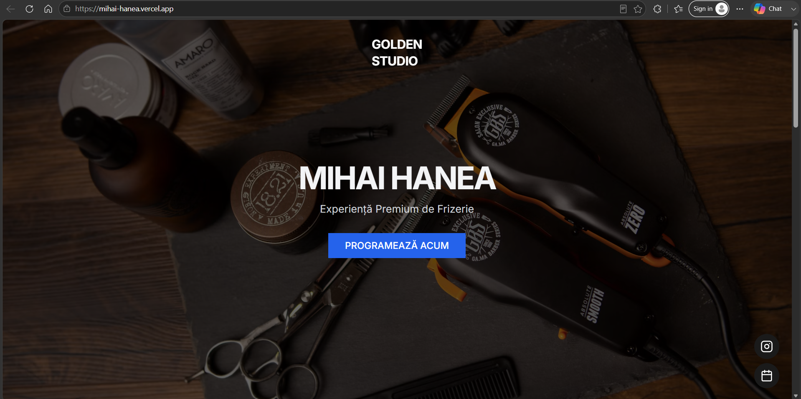
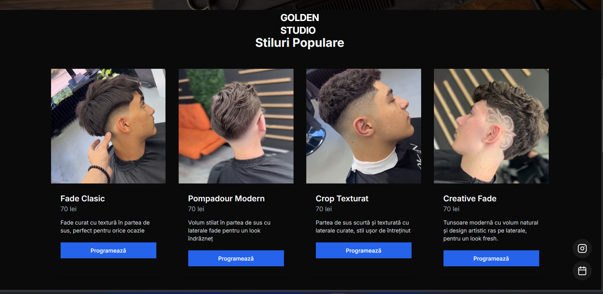
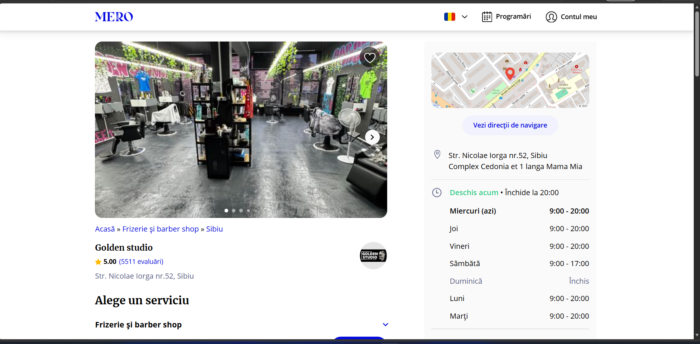

# Barber Shop Website

A modern and responsive barber shop website built with **Next.js**, **React**, and **TypeScript**. The website presents barber services, popular haircut styles, pricing, business information, and appointment call-to-action sections through a clean and premium interface.

---

## Live Demo

https://mihai-hanea.vercel.app/

---

## Features

- Modern and responsive design
- Premium barber shop presentation
- Popular haircut styles section
- Services and pricing section
- Appointment call-to-action buttons
- Business location and contact information
- Opening hours
- Mobile-friendly layout
- Reusable React components

---

## Screenshots

### Homepage



### Services



### Contact and Location



---

## Technologies

- Next.js
- React
- TypeScript
- Tailwind CSS
- Radix UI
- Lucide React
- Vercel

---

## Project Structure

```text
barber-site
├── app
├── components
├── hooks
├── lib
├── public
├── styles
├── screenshots
└── README.md
```

---

## Getting Started

### Requirements

- Node.js
- pnpm or npm

### Installation

Clone the repository:

```bash
git clone https://github.com/Andrei1811/barber-site.git
```

Install dependencies:

```bash
pnpm install
```

Start the development server:

```bash
pnpm dev
```

Open:

```text
http://localhost:3000
```

---

## Project Highlights

- Built with Next.js App Router
- Type-safe development using TypeScript
- Responsive layout for desktop and mobile devices
- Reusable component-based architecture
- Modern user interface designed for a local business
- Deployed using Vercel

---

## Future Improvements

- Online appointment booking
- Appointment confirmation system
- Admin dashboard
- Customer reviews section
- Google Maps integration
- Contact form integration

---

## Author

**Andrei Răulea**
